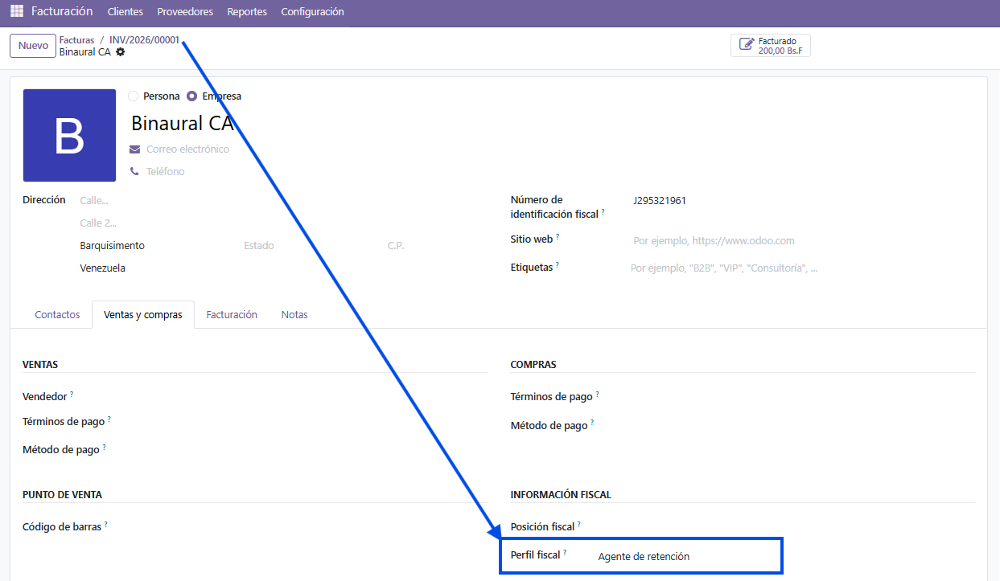
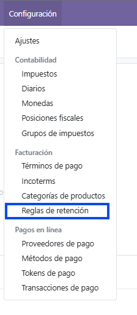
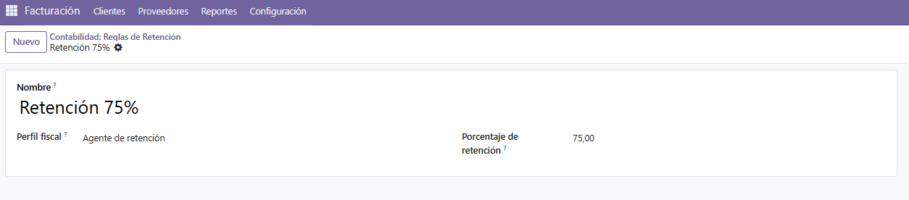
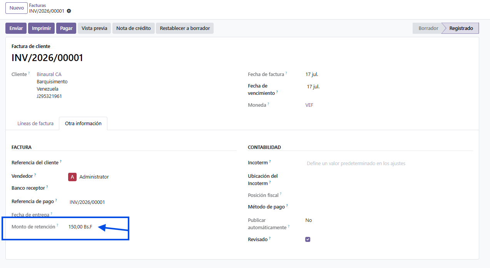
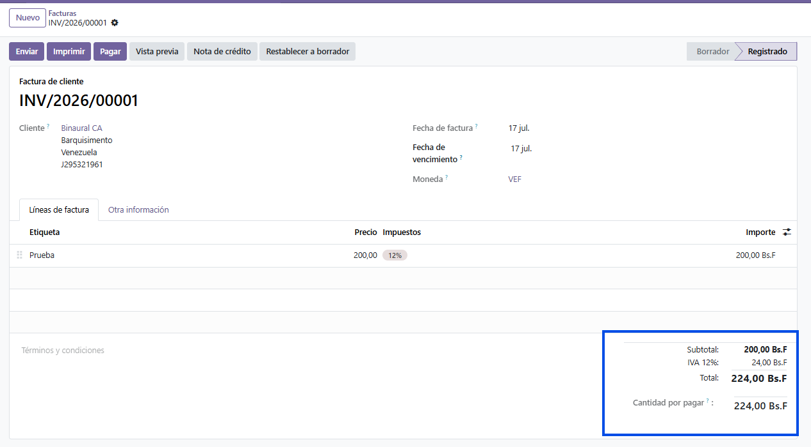

# Objetivo

Aplicar retenciones automáticas en facturas según el perfil fiscal del cliente.

## Criterios de aceptación

* Campo "perfil fiscal" en `res.partner` (estándar, agente de retención, exento).

* Configuración de retenciones mediante una tabla de reglas.

* Aplicación automática de la retención en la factura (`account.move`) al confirmar o validar
  el documento.

* Vista de configuración accesible desde el menú de contabilidad.

* Prueba que valide facturas con y sin retención, incluyendo casos límite (cliente sin perfil
  fiscal definido o sin regla asociada).

# Enfoque de la solución

Se extiende `res.partner` con un campo [`fiscal_profile`](models/res_partner.py#L11)
(`Selection`) y se crea el modelo [`withholding.rule`](models/withholding_rule.py), que asocia
cada perfil fiscal a un porcentaje de retención.

Al confirmar una factura de venta, se extiende
[`account.move._post()`](models/account_move.py#L14) para calcular la retención
(`base imponible x porcentaje`) y guardarla en el campo
[`withholding_amount`](models/account_move.py#L7) de la factura. La base utilizada es
`amount_untaxed` (base imponible, sin impuestos).

## PERFIL FISCAL EN EL CLIENTE

## CONFIGURACIÓN: REGLAS DE RETENCIÓN

Accesibles desde el menú de Contabilidad → Configuración → Facturación → Reglas de retención.

## MONTO DE RETENCIÓN EN LA FACTURA

# Decisiones de diseño

* **Campo `Selection` propio en lugar de reutilizar `account.fiscal.position`**: aunque el
  nombre se parece, la posición fiscal de Odoo es un mecanismo que *reasigna impuestos y
  cuentas* en la factura (`map_tax` / `map_account`), no una clasificación del partner para
  retención. El enunciado pide un campo con valores concretos (estándar / agente de retención
  / exento), por lo que un `Selection` propio es más simple y fiel al requerimiento.

  https://github.com/odoo/odoo/blob/d584beef4ca1f5e63b930eeb415d8c9039c76c15/addons/account/models/partner.py#L154-L165

* **Aplicación sobre facturas de venta (`out_invoice`)**: el enunciado sitúa la retención
  sobre el perfil del *cliente*, y en una factura de venta el `partner_id` es el cliente. Se
  interpreta el `withholding_amount` como la retención que ese cliente practicaría al pagar.
  En el flujo fiscal venezolano real, la retención la practica el comprador sobre facturas de
  proveedor; se optó por seguir la literalidad del enunciado ("perfil fiscal del cliente").

* **Enfoque informativo (no contable)**: la retención se calcula y se almacena en la factura
  como dato, pero no se genera el asiento ni el comprobante de retención. Una implementación
  contable completa (mover el importe retenido a una cuenta de contrapartida, cuadrar el
  asiento, emitir el comprobante) es considerablemente más compleja: el módulo del propio core
  que resuelve esto (`l10n_account_withholding_tax`) supera las 900 líneas y opera a nivel del
  *pago*, no de la factura. Queda fuera del alcance de este ejercicio y se documenta como
  posible extensión.

  https://github.com/odoo/odoo/blob/d584beef4ca1f5e63b930eeb415d8c9039c76c15/addons/l10n_account_withholding_tax/models/account_withholding_line.py

* **Lógica en `_post()` en lugar de `action_post()`**: `_post()` es el método que realiza la
  confirmación real y por el que pasan también las confirmaciones automáticas (cron,
  importación), no solo el botón de la interfaz.

* **Base de cálculo `amount_untaxed`**: coherente con la mecánica de retención de ISLR
  venezolana, que retiene sobre la base imponible sin incluir el IVA.

* **Regla única por perfil ([`UNIQUE(fiscal_profile)`](models/withholding_rule.py#L46))**: se
  impide crear más de una regla de retención para el mismo perfil fiscal, evitando ambigüedad
  al buscar la regla aplicable.

# Casos límite

La retención se calcula en `0` (sin retención) cuando:

* El partner no tiene perfil fiscal definido.
* El perfil fiscal del partner no tiene una regla asociada.

# Pruebas

* [`test_withholding_applied_agent_profile`](tests/test_fiscal_profile_withholding.py#L44):
  factura de un cliente con perfil y regla; se verifica que
  `withholding_amount == base x porcentaje`.
* [`test_no_withholding_without_profile`](tests/test_fiscal_profile_withholding.py#L57):
  cliente sin perfil fiscal; retención 0.
* [`test_no_withholding_without_rule`](tests/test_fiscal_profile_withholding.py#L66): cliente
  con perfil pero sin regla asociada; retención 0.
* [`test_check_withholding_percentage`](tests/test_fiscal_profile_withholding.py#L75): el
  `CHECK` del porcentaje (0-100) rechaza valores fuera de rango (`CheckViolation`).
* [`test_unique_fiscal_profile`](tests/test_fiscal_profile_withholding.py#L90): el
  `UNIQUE(fiscal_profile)` impide reglas duplicadas por perfil (`UniqueViolation`).
