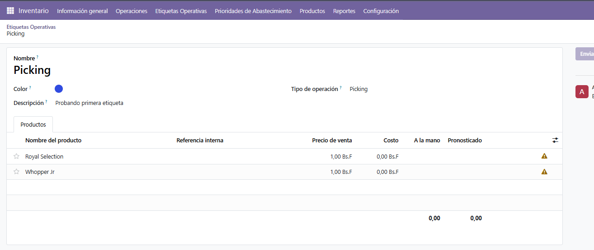
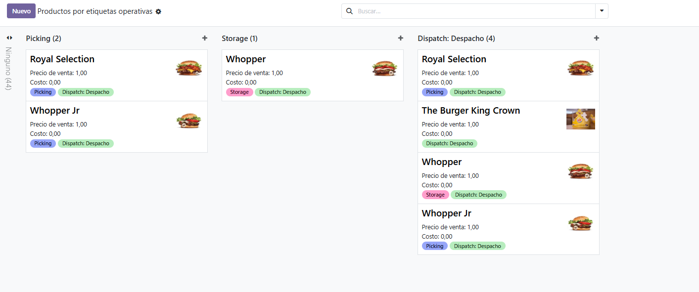
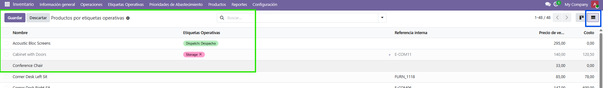
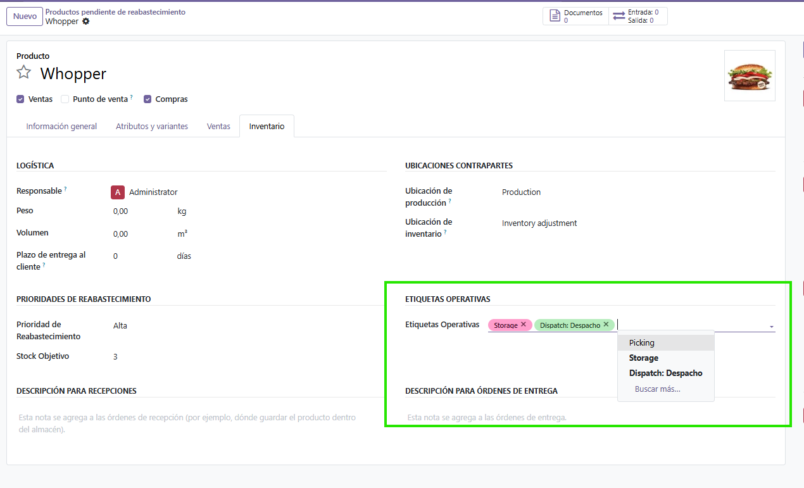

# Objetivo

Permitir clasificar productos con etiquetas operativas para optimizar picking,
almacenamiento y despacho.

## Criterios de aceptación

* Nuevo modelo `stock.operation.tag` con campos: `name`, `color`, `description`,
  `operation_type`.

* Relación *many2many* entre `product.template` y `stock.operation.tag`.

* Vista kanban en inventario que muestre productos agrupados por etiquetas operativas
  o tipo de operación.

* Acción rápida en la vista de producto para asignar o remover etiquetas sin abrir el
  formulario completo.

* Prueba que valide la creación de etiquetas, su asignación a productos y su visualización
  en la vista kanban.

# Enfoque de la solución

Se crea el modelo `stock.operation.tag` (etiqueta operativa) y se extiende
`product.template` con un campo *many2many* hacia dicho modelo. La misma tabla relación
(`product_template_stock_operation_tag_rel`) se declara en ambos lados, por lo que la
relación es única y bidireccional.

Sobre `product.template` se añaden:

* Una **vista kanban** de productos agrupada por sus etiquetas operativas.
* Una **vista de lista** con edición múltiple (`multi_edit`) que permite asignar o remover
  etiquetas a varios productos sin abrir el formulario completo (acción rápida).

## VISTA FORMULARIO: ETIQUETAS OPERATIVAS (stock.operation.tag)

## VISTA KANBAN

* **Agrupación de la kanban por etiqueta, no por `operation_type`**: el campo
  `operation_type` vive en la etiqueta, no en el producto. Odoo solo permite `group_by`
  con path punteado (un_campo.otro_campo) sobre campos `many2one`, no sobre `many2many`, por lo que no es posible
  agrupar productos por `stock_operation_ids.operation_type` directamente. La kanban agrupa
  por el propio *many2many* (`default_group_by="stock_operation_ids"`); un producto con
  varias etiquetas aparece en varias columnas, comportamiento esperado del agrupamiento por
  *many2many*.

## VISTA DE LISTA

Edición múltiple (`multi_edit`) que permite asignar o remover etiquetas a varios
productos sin abrir el formulario completo (acción rápida).

## VISTA FORMULARIO: PRODUCTOS

# Decisiones de diseño

* **Valores de `operation_type`**: se usa un `Selection` con `picking`, `storage` y
  `dispatch`, que son los tres verbos que el propio enunciado nombra en su objetivo
  ("picking, almacenamiento y despacho"). 

* **`color` como `Integer` con default aleatorio**: se replica el patrón de `project.tags`
  (`randint(1, 11)`) , de modo que cada etiqueta nace con un color distinto de la paleta
  estándar de Odoo y se integra con el `widget` de color de las vistas.

* **Seguridad**: se define un grupo propio de gestión de etiquetas operativas (categoría +
  privilegio + grupo) y las reglas de acceso correspondientes: lectura para el usuario
  interno y CRUD completo para el grupo de gestión.

# Pruebas

Cubren los tres puntos del criterio de pruebas:

* Creación de una etiqueta y verificación de sus campos.
* Asignación de una etiqueta a un producto y verificación de la relación *many2many* en
  ambos sentidos.
* Agrupación (`_read_group`) por el *many2many*, verificando que un producto con varias
  etiquetas se cuenta en varios grupos (la duplicación que alimenta la kanban).

