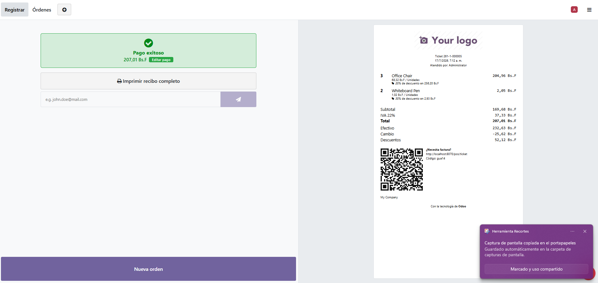
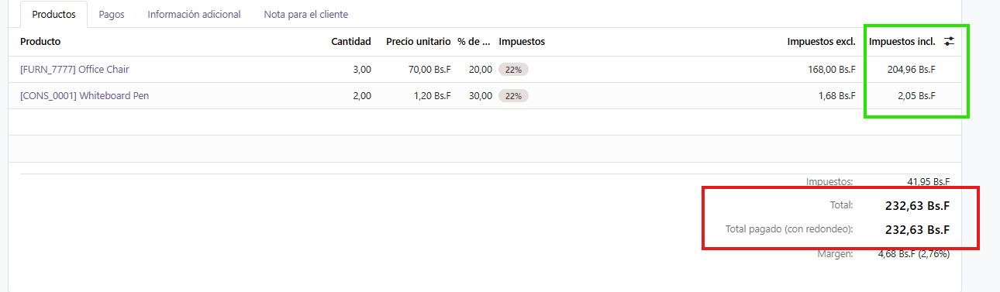
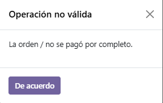

# Objetivo

Aplicar descuentos automáticos en el punto de venta según franjas horarias configurables.

## Criterios de aceptación

* Nuevo modelo de configuración para definir reglas con campos como: `name`, `hour_from`,
  `hour_to`, `discount_percentage`.

* Aplicación automática del descuento en una orden de **pos.order** cuando la venta se registre
  dentro del horario definido.

* Validación para evitar que se apliquen múltiples descuentos incompatibles sobre la misma orden.

* Vista de configuración accesible desde el menú de punto de venta.

* Prueba que valide órdenes con y sin descuento, incluyendo casos límite (ej. orden fuera del
  rango horario o reglas solapadas).

# Enfoque de la solución

La implementación se realizó del lado del **backend**, que es lo interpretado a partir del enunciado:

el ejercicio indica explícitamente *"aplicación automática del descuento en una orden de
`pos.order`"*, y el criterio de pruebas exige validar órdenes con y sin descuento, es decir,
tests unitarios de Python sobre el modelo.

El punto de venta es una aplicación de Odoo Web Library (JavaScript) que mantiene su propio modelo de la orden en
memoria y calcula los totales en el navegador. La orden solo llega al servidor cuando el cajero
valida el pago, mediante `sync_from_ui()`, que a su vez crea o actualiza los registros invocando
`_process_order()`. Aquí el código fuente donde se hace el proceso:

https://github.com/odoo/odoo/blob/b968f3e3bbfc49994b8fa2d1e42fa4ea1dafcc1b/addons/point_of_sale/models/pos_order.py#L1241

## Limitaciones conocidas

Aplicar el descuento en el backend implica que este se calcula **después** de que el cajero haya
cobrado, ya que el pago ocurre en el frontend antes de la sincronización. En consecuencia, el
importe cobrado no reflejaría el descuento y la orden quedaría descuadrada (`amount_paid`
distinto de `amount_total`).

Esto también trae como consecuencia que la suma de los totales de cada producto será distinta al total de la orden.

Una implementación productiva requeriría extender también el **frontend**, para que el cajero vea
los descuentos en tiempo real y los totales a pagar coincidan con los que muestra la orden una vez
calculados impuestos y descuentos.

### Evidencia

Ticket de una venta real con una regla del 20% activa:



| Línea | Descuento manual | Regla | Aplicado |
|---|---|---|---|
| Office Chair | 10% | 20% | **20%** (la regla lo eleva) |
| Whiteboard Pen | 30% | 20% | **30%** (se respeta el manual) |

La política de aplicar el mayor descuento se cumple en ambos sentidos. Sin embargo, el ticket
evidencia la limitación descrita:

```
Total       207,01 Bs.F   <- total de la orden, con el descuento ya aplicado
Efectivo    232,63 Bs.F   <- importe realmente cobrado al cliente
Cambio      -25,62 Bs.F   <- cambio negativo: el cliente pagó de más
```

El cliente abonó el total previo a la regla, el descuento se aplicó al sincronizar la orden, y la
diferencia queda como un cambio negativo que nadie devolvió. Es la consecuencia directa de aplicar
el descuento después del cobro.

La misma orden vista en el backend muestra el descuadre entre líneas y cabecera:



En verde, las líneas con el descuento ya aplicado (204,96 + 2,05 = **207,01**). En rojo, la
cabecera de la orden, que conserva el total sin descuento (**232,63**), porque `amount_total` y
`amount_tax` no son campos calculados: el POS los computa en el navegador y el servidor únicamente
los almacena.

Recalcularlos en el `create` con `_compute_prices()` no es viable: ese método también reescribe
`amount_paid` a partir de `payment_ids`, y los pagos todavía no existen en ese punto del flujo
(`_process_order` los crea después). El resultado es `amount_paid = 0`, y el punto de venta
rechaza el cobro al comprobar que `amount_total - amount_paid` no es cero:



Con esa llamada añadida, el flujo de venta queda inutilizable: ya no es posible ni cobrar la
orden. Por eso se descartó.

Se opta por dejar la cabecera sin recalcular: el descuadre queda acotado a un dato de
visualización, mientras que aplicar el descuento antes del cobro —única solución real— exige la
implementación en el frontend descrita arriba.

