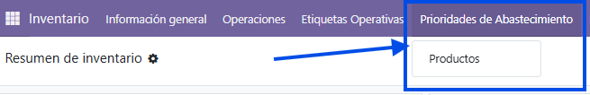
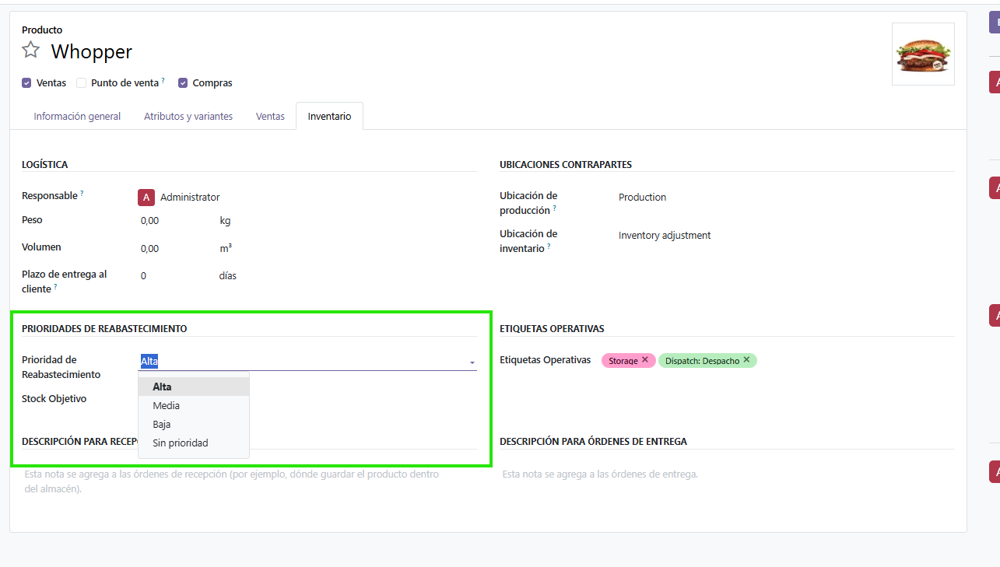
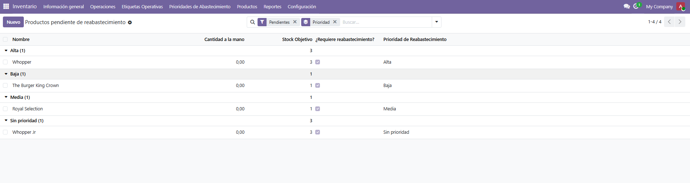
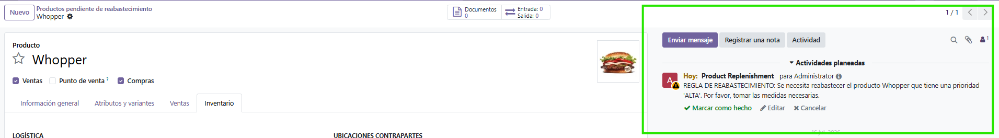

# Objetivo

Automatizar la priorización de productos para reabastecimiento interno según su criticidad
operativa.

## Criterios de aceptación

* Campo "prioridad de reabastecimiento" en `product.template` (baja, media, alta).

* Campo "stock objetivo" en `product.template`.

* Acción automática que identifique productos con `qty_available` por debajo del stock
  objetivo y genere una actividad (`mail.activity`) para el responsable del almacén.

* Vista de lista o tablero en inventario que muestre los productos pendientes de
  reabastecimiento, agrupados por prioridad.

* Prueba que valide la creación de actividades para productos por debajo del stock objetivo
  y que no se creen duplicados innecesarios para el mismo producto.

# Enfoque de la solución

Se extiende `product.template` con dos campos ([`replenishment_priority`](models/product_template.py#L17)
y [`target_stock`](models/product_template.py#L23)) y un campo calculado
[`needs_replenishment`](models/product_template.py#L27) que indica si el producto está por
debajo de su objetivo (`qty_available < target_stock`).

Una acción programada (`ir.cron`) invoca el método
[`_cron_check_target_stock`](models/product_template.py#L45), que recorre los productos que
necesitan reabastecimiento y, por cada uno, agenda una actividad (`mail.activity`) dirigida a
su responsable, evitando crear duplicados si ya existe una actividad pendiente para ese
producto.

## MENÚ

## VISTA FORMULARIO: PRODUCTO

## VISTA DE PRODUCTOS PENDIENTES

La vista se filtra por `needs_replenishment` y se agrupa por `replenishment_priority`.

## ACTIVIDAD GENERADA

# Decisiones de diseño

* **[`needs_replenishment`](models/product_template.py#L27) calculado con método `search`, no
  almacenado**: depende de `qty_available`, que es un campo calculado, no almacenado y
  dependiente del contexto (almacén/ubicación). Por eso no es viable `store=True`. Se replica
  el patrón del propio `qty_available` de los modulos base de Odoo: `compute` +
  [`search='_search_needs_replenishment'`](models/product_template.py#L38), 
  que traduce el filtro sobre el campo calculado a un dominio por `id`. 
  Esto permite filtrar y usar el campo en la vista sin almacenarlo.

  https://github.com/odoo/odoo/blob/d584beef4ca1f5e63b930eeb415d8c9039c76c15/addons/stock/models/product.py#L52-L53

* **Anti-duplicados por `activity_type_id`, no por el texto de la nota**: comparar el texto
  de la nota sería frágil (cambia con el nombre o la prioridad del producto). Se compara por
  tipo de actividad, que es estable. Además, se crea un
  [**tipo de actividad propio**](data/mail_activity_type.xml#L4) (`mail.activity.type`) en
  lugar de reutilizar el genérico del core, para no colisionar con las actividades que
  `stock.orderpoint` también crea sobre productos.

* **Ciclo de vida de la actividad**: al marcar una actividad como hecha, Odoo la elimina
  (se convierte en un mensaje del chatter). Por eso el chequeo de duplicados no necesita
  filtrar por estado: cualquier `mail.activity` que exista es, por definición, pendiente. Si
  el responsable la completa y el producto sigue por debajo del objetivo, la siguiente
  ejecución del cron genera una nueva.

* **Fecha límite según prioridad**: [`_get_priority_date_to_overdue`](models/product_template.py#L99) asigna el plazo de la
  actividad según la prioridad (`alta` = 1 día, `media` = 4, `baja` = 8). Un producto sin
  prioridad (`none`) cae al plazo por defecto de 4 días (equivalente a "media").

* **Valor `none` explícito en el `Selection`**: se modela "sin prioridad" como un valor real
  del campo (con `default='none'`) en lugar de dejar el campo vacío, evitando que los grupos
  vacíos se muestren como `false` en las vistas agrupadas.

# Pruebas

* [`test_activity_created_below_target`](tests/test_priority_replenishment.py#L42): un
  producto por debajo del objetivo genera una actividad, verificando su `res_id`,
  `res_model_id` y `activity_type_id`.
* [`test_activity_not_created`](tests/test_priority_replenishment.py#L72): un producto que no
  está por debajo del objetivo no genera actividad.
* [`test_no_duplicate_activity`](tests/test_priority_replenishment.py#L84): al ejecutar el
  cron dos veces (cambiando la prioridad entre ambas) sigue existiendo una única actividad,
  validando el anti-duplicados.